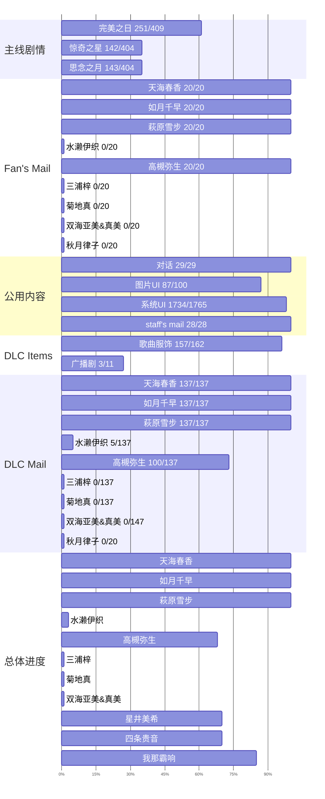

# 汉化进度

偶像大师SP汉化项目各部分进度如下(处理文件数量 / 总文件数量)：

```mermaid!
%%{init:{
  "gantt" :{
    "barGap":12,
    "barHeight": 36,
    "fontSize":20,
    "sectionFontSize":25,
    "leftPadding":150
  }
}}%%
gantt
    title 　
    dateFormat  X
    axisFormat %s%%

	section 主线剧情
    完美之日 251/409 : ps,0,61
    惊奇之星 142/404 : ws,0,35
    思念之月 143/404 : mm,0,35
    section Fan's Mail
    天海春香 20/20 : har,0,100
    如月千早 20/20 : chi,0,100
    萩原雪步 20/20 : yuk,0,100
    水濑伊织 0/20 : ior,0,1
    高槻弥生 20/20 : yay,0,100
    三浦梓 0/20 : azu,0,1
    菊地真 0/20 : mak,0,1
    双海亚美&真美 0/20 : mam,0,1
    秋月律子 0/20 : rit,0,1
    section 公用内容
    对话 29/29 : com,0,100
    图片UI 87/100 : iu,0,87
    系统UI 1734/1765: su,0,98
    staff's mail 28/28 : sm,0,100
    section DLC Items
    歌曲服饰 157/162 : di,0,96
    广播剧 3/11 : drama,0,27
    section DLC Mail
    天海春香 137/137 : har,0,100
    如月千早 137/137 : chi,0,100
    萩原雪步 137/137 : yuk,0,100
    水濑伊织 5/137 : ior,0,5
    高槻弥生 100/137 : yay,0,73
    三浦梓 0/137 : azu,0,1
    菊地真 0/137 : mak,0,1
    双海亚美&真美 0/147 : mam,0,1
    秋月律子 0/20 : rit,0,1
    section 总体进度
    天海春香 : har,0,100
    如月千早 : chi,0,100
    萩原雪步 : yuk,0,100
    水濑伊织 : ior,0,3
    高槻弥生 : yay,0,68
    三浦梓 : azu,0,1
    菊地真 : mak,0,1
    双海亚美&真美 : mam,0,1
    星井美希 : mik,0,70
    四条贵音 : tak,0,70
    我那霸响 : hib,0,85
```







## 效果预览





## 相关下载



